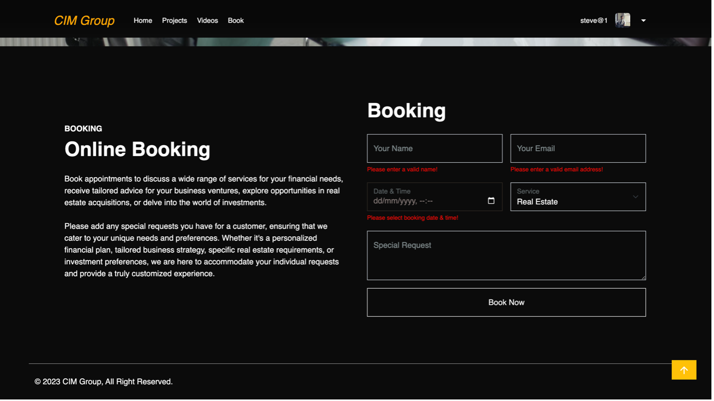

# CIM Group Training Website
A platform for accessing project-related videos and information.

## Table of Contents
- [Overview](#overview)
- [Features](#features)
- [Screenshots](#screenshots)
- [Technologies Used](#technologies-used)
- [Usage](#usage)

## Overview
The CIM Group Training Website is designed to provide access to project-related videos and information for training purposes to staff and property advisors. It offers a user-friendly interface for both administrators and staff members to manage training content and appointments.

## Features
- Comprehensive Admin Dashboard for managing training content, including Create, Read, Update, and Delete (CRUD) operations.
- Staff Dashboard for accessing training videos and booking appointments with clients for project-related investments.

## Screenshots
### Staff UI
 
 
 
 
 

### Admin UI
 
 
 
 
 
 
 

## Technologies Used
- Backend: Node.js and Express for the backend API, JWT token authentication
- Database: MongoDB Atlas for database management
- Frontend: React for the user interface
- Firebase: Storage for content

## Usage
Please check README file inside the `api` and `frontend` folders for further instructions.

